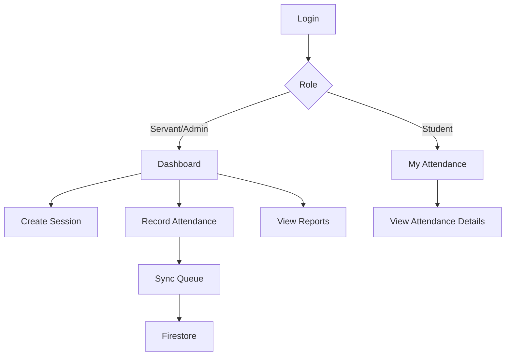
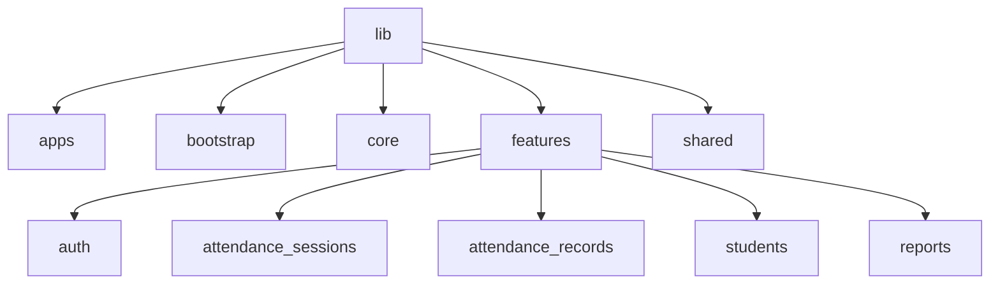
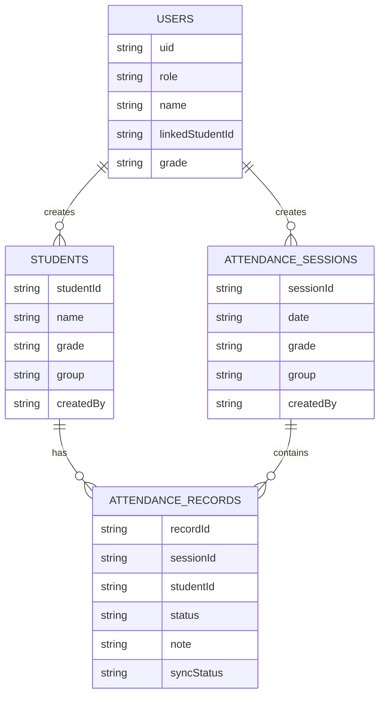

# Attendance Management System — Project Plan

## 1) Project Overview

### Core Roles & Capabilities
- **Servant/Admin**
  - Add and manage students.
  - Create attendance sessions (per grade/group/date).
  - Record attendance (Present/Absent + optional note).
  - View attendance reports for a class/group.
- **Student**
  - View personal attendance history and summaries.

### Non-Functional Goals
- Offline-first support with reliable sync.
- Secure, role-based access control.
- Predictable structure for scalable development.
- Fast onboarding for new team members.

---

## 2) Tech Stack

- **Flutter** (Android/iOS).
- **Firebase**
  - **Firebase Auth** for authentication.
  - **Firestore** for data storage.
  - **Cloud Functions** for synchronization and server-side validation.
- **Offline Storage**
  - **Hive** or **SQLite** for local cache and sync queue.

---

## 3) Functional Requirements

### Authentication
- Authenticate users with Firebase Auth.
- Enforce role-based capabilities after login.

### Attendance Recording
- Servant/Admin records attendance as Present/Absent with optional note.
- Save to Firestore when online.
- If offline, save locally and sync later.

### Reporting
- Servant/Admin: full group reports (filters by grade, group, date range).
- Student: personal attendance history and summary.

---

## 4) Data Modeling

### Firestore Collections
- **users**: `{uid, role, name, linkedStudentId, grade}`
- **students**: `{studentId, name, grade, group, createdBy}`
- **attendanceSessions**: `{sessionId, date, grade, group, createdBy}`
- **attendanceRecords**: `{recordId, sessionId, studentId, status, note, syncStatus}`

### Example Document Data
```json
// users/{uid}
{
  "uid": "u123",
  "role": "servant",
  "name": "Sara",
  "linkedStudentId": null,
  "grade": "6"
}

// students/{studentId}
{
  "studentId": "s101",
  "name": "John",
  "grade": "6",
  "group": "A",
  "createdBy": "u123"
}

// attendanceSessions/{sessionId}
{
  "sessionId": "sess-2025-04-09-6A",
  "date": "2025-04-09",
  "grade": "6",
  "group": "A",
  "createdBy": "u123"
}

// attendanceRecords/{recordId}
{
  "recordId": "rec-001",
  "sessionId": "sess-2025-04-09-6A",
  "studentId": "s101",
  "status": "present",
  "note": "On time",
  "syncStatus": "synced"
}
```

---

## 5) Security Rules

### Role-Based Access
- **Servant**: read/write only for their assigned grade/group.
- **Student**: read only their own attendance records.

### Example Firestore Rules (baseline)
```firestore
match /attendanceRecords/{recordId} {
  allow read, update: if request.auth != null
    && request.auth.uid == resource.data.studentId;
  allow create: if request.auth != null
    && request.auth.uid == resource.data.servantId;
}
```

> Note: In production, add grade/group checks and admin overrides.

---

## 6) Offline Sync Strategy

- Cache all attendance records in **Hive/SQLite**.
- Queue changes locally when offline.
- Sync queue replays when connectivity restores.
- Cloud Functions validate server-side and resolve conflicts.

---

## 7) Deliverables

### A) Project Overview
- Functional and non-functional requirements (this doc).

### B) UI/UX Screens
- **Servant/Admin**
  - Login
  - Dashboard
  - Student List
  - Attendance Session Create
  - Attendance Recording
  - Reports
- **Student**
  - Login
  - My Attendance
  - Attendance Details

### C) Firestore Schema
- Collections: `users`, `students`, `attendanceSessions`, `attendanceRecords`.

### D) Security Rules
- Role- and ownership-based access controls.

### E) Flutter Structure
```
lib/
├── apps/
├── bootstrap/
├── core/
├── features/
│   ├── auth/
│   ├── attendance_sessions/
│   ├── attendance_records/
│   ├── students/
│   └── reports/
├── shared/
└── main_*.dart
```

### F) BLoC (Events/States)
- **AuthBloc**
  - Events: `AppStarted`, `SignInRequested`, `SignOutRequested`
  - States: `AuthInitial`, `AuthLoading`, `Authenticated`, `Unauthenticated`, `AuthError`
- **AttendanceSessionBloc**
  - Events: `LoadSessions`, `CreateSession`
  - States: `SessionsLoading`, `SessionsLoaded`, `SessionCreating`, `SessionCreated`, `SessionsError`
- **AttendanceRecordBloc**
  - Events: `LoadRecords`, `MarkPresent`, `MarkAbsent`, `AddNote`, `SyncPending`
  - States: `RecordsLoading`, `RecordsLoaded`, `RecordUpdating`, `Syncing`, `RecordsError`
- **SyncBloc**
  - Events: `QueueUpdated`, `ConnectivityRestored`, `SyncStarted`, `SyncCompleted`
  - States: `SyncIdle`, `SyncInProgress`, `SyncFailed`, `SyncSuccess`

### G) Firestore Queries (Examples)
- **Servant**: Fetch all students in grade/group
  ```dart
  FirebaseFirestore.instance
    .collection('students')
    .where('grade', isEqualTo: grade)
    .where('group', isEqualTo: group)
    .get();
  ```
- **Attendance Session**: Fetch session records
  ```dart
  FirebaseFirestore.instance
    .collection('attendanceRecords')
    .where('sessionId', isEqualTo: sessionId)
    .get();
  ```
- **Student**: Fetch personal records
  ```dart
  FirebaseFirestore.instance
    .collection('attendanceRecords')
    .where('studentId', isEqualTo: studentId)
    .orderBy('date', descending: true)
    .get();
  ```

### H) Testing Plan
- **Unit Tests**
  - Repositories, data sources, mappers.
  - Offline sync queue logic.
- **Widget Tests**
  - Attendance recording UI.
  - Student list and filters.
- **Integration Tests**
  - Full flow: login → create session → mark attendance → sync.
- **UI Testing Strategy**
  - Golden tests for key screens.

---

## 8) Final Checklist

- [ ] Authentication flows complete and secure.
- [ ] Role-based access rules validated.
- [ ] Offline queue tested and reliable.
- [ ] Attendance session creation works end-to-end.
- [ ] Attendance recording flows tested.
- [ ] Reports accurate and filterable.
- [ ] UI/UX approved.
- [ ] All tests passing.

---

# Visual Representations

## UI Design (Wireframe)

```
+------------------+        +------------------+
|  Login Screen    |        |  Dashboard       |
|  [Email]         | -----> |  Sessions        |
|  [Password]      |        |  Reports         |
|  [Sign In]       |        |  Students        |
+------------------+        +------------------+

+------------------+        +------------------+
| Attendance List  | -----> | Record Attendance|
| [Student A]      |        | Present / Absent |
| [Student B]      |        | [Note] [Save]    |
+------------------+        +------------------+
```

## User Journey Flowchart



## Folder Structure Diagram



## Database Schema Diagram


