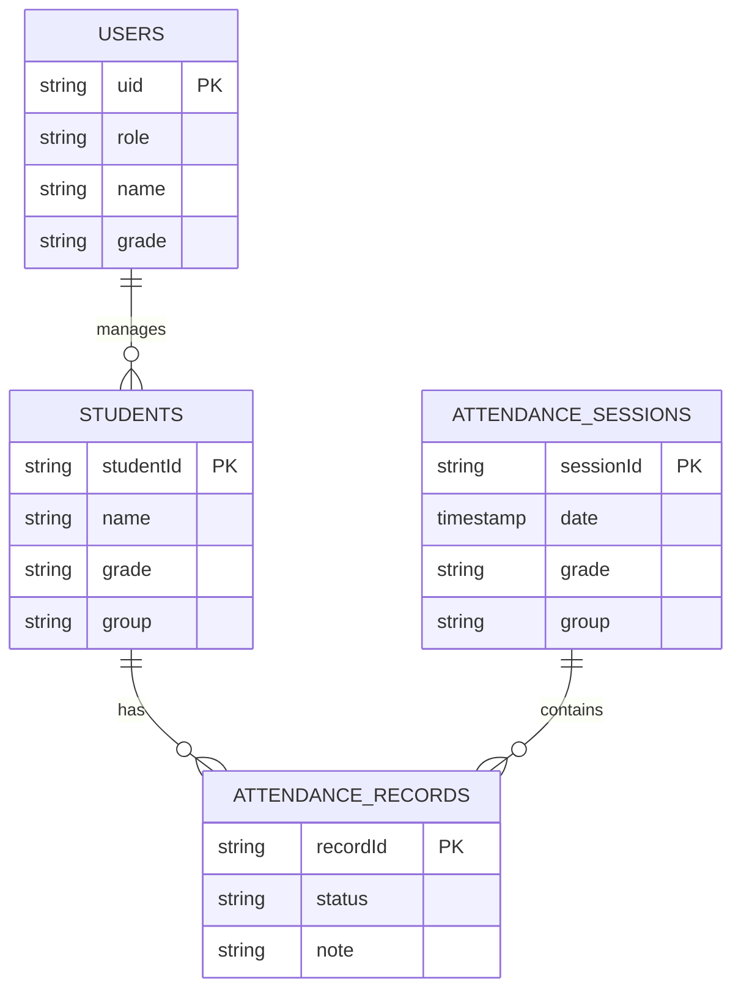

# Attendance Management System - Project Plan

## 1. Project Overview

The **Attendance Management System** is a mobile application designed to streamline the process of tracking student attendance for servants and admins, while providing students with access to their own attendance records. The system prioritizes data integrity, offline accessibility, and secure synchronization.

### Core Functionalities & Roles

*   **Servant/Admin**:
    *   **Management**: Add and manage student profiles.
    *   **Attendance**: Record attendance sessions (Present/Absent) with optional notes.
    *   **Reporting**: View comprehensive attendance reports for assigned groups/grades.
    *   **Offline Mode**: Perform all actions offline, with automatic synchronization when connectivity is restored.

*   **Student**:
    *   **View Access**: View their personal attendance history and status.
    *   **Profile**: View basic profile information.

## 2. Tech Stack

*   **Mobile Framework**: **Flutter** (Dart) for cross-platform support (Android & iOS).
*   **Backend & Cloud (Firebase)**:
    *   **Authentication**: Firebase Auth (Email/Password, Phone, or Social).
    *   **Database**: Cloud Firestore (NoSQL) for scalable, real-time data storage.
    *   **Logic/Sync**: Firebase Cloud Functions (for complex aggregations or triggered sync operations).
*   **Local Storage (Offline-First)**:
    *   **Hive**: Lightweight, fast key-value database for storing attendance data locally when offline.
    *   *Rationale*: Hive is preferred over SQLite for its speed and ease of use with Flutter objects.

## 3. Functional Requirements

### 3.1 Authentication
*   **Servants/Admins**: Secure login via Firebase Auth.
*   **Students**: Secure login (linked to their student ID) to view records.
*   **Session Management**: Persist user sessions securely.

### 3.2 Attendance Recording (Smart Sync)
*   **Workflow**:
    1.  Servant selects a Grade/Group.
    2.  App creates an `attendanceSession` (date, group details).
    3.  Servant marks status for each student in the list.
*   **Offline Strategy**:
    *   **Online**: Data writes directly to Firestore.
    *   **Offline**: Data is written to local Hive boxes with a `sync_status: 'pending'` flag.
    *   **Restoration**: A background listener monitors connectivity. When online, pending records are pushed to Firestore, and local Hive data is updated.

### 3.3 Reporting
*   **Group Report**: Servants see a matrix or list view of students vs. dates.
*   **Student View**: Students see a timeline or calendar view of their own attendance.

## 4. Data Modeling (Firestore Schema)

The database is structured to support scalability and security rules efficiently.

### Collections

#### `users`
Stores profile data for authenticated users (Servants and Students).
```json
{
  "uid": "string (Firebase Auth ID)",
  "role": "string ('admin' | 'servant' | 'student')",
  "name": "string",
  "linkedStudentId": "string (optional, if role is student)",
  "grade": "string (e.g., '10th Grade')",
  "email": "string"
}
```

#### `students`
The roster of students managed by servants.
```json
{
  "studentId": "string (Auto-ID)",
  "name": "string",
  "grade": "string",
  "group": "string",
  "createdBy": "string (servant_uid)",
  "createdAt": "timestamp"
}
```

#### `attendanceSessions`
Represents a specific class or meeting event.
```json
{
  "sessionId": "string (Auto-ID)",
  "date": "timestamp",
  "grade": "string",
  "group": "string",
  "createdBy": "string (servant_uid)"
}
```

#### `attendanceRecords`
The individual record linking a student to a session.
```json
{
  "recordId": "string (Auto-ID)",
  "sessionId": "string (ref: attendanceSessions)",
  "studentId": "string (ref: students)",
  "status": "string ('present' | 'absent' | 'excused')",
  "note": "string",
  "syncStatus": "string (local-only field: 'synced' | 'pending')",
  "timestamp": "timestamp"
}
```

### Database Schema Diagram



## 5. Security Rules

We leverage Firestore Security Rules to enforce data access policies.

### Rules Logic
*   **Servant**: Read/Write access to `students`, `attendanceSessions`, and `attendanceRecords` where `grade` matches their assignment.
*   **Student**: Read-only access to `attendanceRecords` where `studentId` matches their linked ID.

### Example Firestore Rules
```javascript
rules_version = '2';
service cloud.firestore {
  match /databases/{database}/documents {

    // Helper functions
    function isSignedIn() {
      return request.auth != null;
    }
    function isServant() {
      return isSignedIn() && get(/databases/$(database)/documents/users/$(request.auth.uid)).data.role in ['servant', 'admin'];
    }

    // Attendance Records
    match /attendanceRecords/{recordId} {
      // Student can read their own records
      allow read: if isSignedIn() && request.auth.uid == resource.data.studentId;

      // Servants can create/update records
      allow read, write: if isServant();
    }

    // Students Collection
    match /students/{studentId} {
      allow read: if isSignedIn();
      allow write: if isServant();
    }
  }
}
```

## 6. Offline Sync Strategy

To ensure zero data loss during connectivity issues, we implement the following strategy:

1.  **Local Write**: All "write" operations (Create, Update) are first committed to a local **Hive** box named `pending_actions`.
2.  **Optimistic UI**: The UI updates immediately based on the local Hive data, providing a snappy experience.
3.  **Connectivity Listener**: A background service (`ConnectivityPlus`) listens for network state changes.
4.  **Sync Process**:
    *   **Trigger**: Network connection restored.
    *   **Action**: Iterate through `pending_actions`.
    *   **Execute**: Send requests to Firestore/Cloud Functions.
    *   **Cleanup**: On success, remove from `pending_actions` and update local cache. On failure, retry with exponential backoff.
5.  **Conflict Resolution**: Server timestamp wins. If a record was modified on the server more recently than the local creation time, the server data takes precedence.

## 7. Deliverables & Folder Structure

### 7.1 Flutter Folder Structure

```text
lib/
├── main.dart                  # App entry point
├── core/
│   ├── config/                # Environment config
│   ├── constants/             # Strings, Assets, API endpoints
│   ├── services/              # Global services (Connectivity, Hive)
│   ├── utils/                 # Helpers (Date formatters, Validators)
│   └── widgets/               # Shared UI components (Buttons, Loaders)
├── features/
│   ├── auth/                  # Authentication Feature
│   │   ├── data/              # Auth Repositories & Sources
│   │   ├── domain/            # Auth UseCases & Entities
│   │   └── presentation/      # Login Screens & BLoCs
│   ├── attendance/            # Attendance Feature
│   │   ├── data/
│   │   │   ├── models/        # AttendanceRecordModel, SessionModel
│   │   │   ├── datasources/   # FirestoreDataSource, HiveLocalDataSource
│   │   │   └── repositories/  # AttendanceRepositoryImpl (Sync logic here)
│   │   ├── domain/
│   │   │   └── ...
│   │   └── presentation/
│   │       ├── bloc/          # AttendanceBloc (Events: Load, Mark, Sync)
│   │       ├── pages/         # SessionList, TakeAttendance, ReportView
│   │       └── widgets/       # StudentRow, AttendanceStatusToggle
│   └── students/              # Student Management Feature
└── injection_container.dart   # Dependency Injection (GetIt) Setup
```

### 7.2 UI/UX Journey

#### User Journey Flowchart
```mermaid
graph TD
    A[Launch App] --> B{Auth Status?}
    B -- No --> C[Login Screen]
    C --> D{Role?}
    B -- Yes --> D

    D -- Servant --> E[Servant Dashboard]
    E --> F[Select Group]
    F --> G[Attendance List]
    G --> H[Mark Present/Absent]
    H --> I{Online?}
    I -- Yes --> J[Save to Firestore]
    I -- No --> K[Save to Hive (Pending)]

    D -- Student --> L[Student Dashboard]
    L --> M[View History]
    M --> N[Filter by Date]
```

### 7.3 BLoC Architecture
*   **AuthBloc**: `AppStarted`, `LoggedIn`, `LoggedOut`.
*   **AttendanceBloc**:
    *   **Events**: `LoadSessions`, `CreateSession`, `UpdateRecord`, `SyncPendingData`.
    *   **States**: `AttendanceLoading`, `AttendanceLoaded` (list of students with status), `AttendanceError`, `Syncing`.

## 8. Final Checklist (Pre-Delivery)

- [ ] **Auth**: Verify Login/Logout flows for both Servants and Students.
- [ ] **Data**: Ensure Firestore collections are created and populated with seed data.
- [ ] **Sync**: Test "Airplane Mode" scenario. Mark attendance offline -> Turn on Internet -> Verify Firestore update.
- [ ] **Security**: Deploy and test Firestore Security Rules (try to read unassigned data).
- [ ] **UI**: Verify responsiveness on different screen sizes.
- [ ] **Code Quality**: Run `flutter analyze` and fix all linting errors.
- [ ] **Tests**: Run unit tests for Repositories and BLoCs.

---

**Note**: This plan serves as a living document. Updates should be versioned and communicated to the development team.
